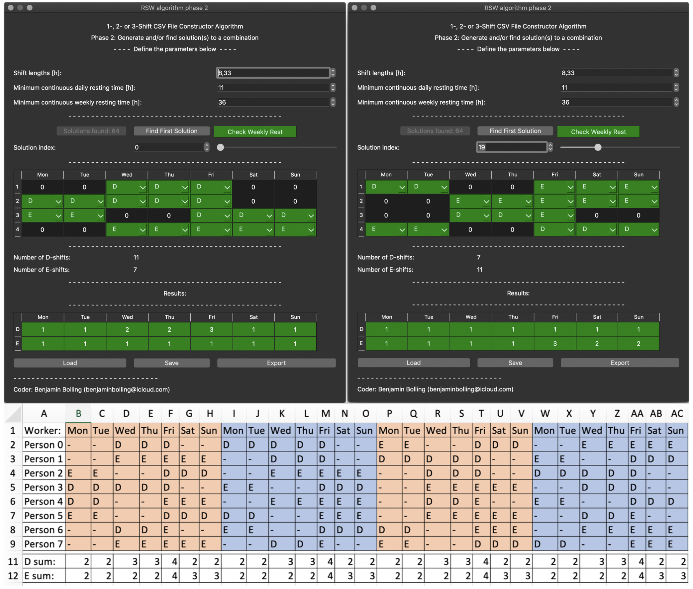

# RSW Algo README
A simple Python-based Computational Approach to Generate Multi-Shift Rotational Workforce Schedules.

Generating schedules for shift workers is essential for many employers, whether the employer is a small or a large industrial complex, research laboratory, or other businesses involving shift works.

Previous methods for creating rotational workforce schedules included interactions between the schedule maker and the algorithm, including defining the length of sequences of consecutive days of working shifts.

In this project, an algorithm takes into account inputs (or constraints) from the schedule maker and then presents the possible combinations (incl. that all shifts must be filled, working hours per week, minimal resting time, etc.) in a first phase. The schedule maker can then select which combinations are most feasible to proceed with in the second phase, where the combinations have solutions presented followed by the final schedules being constructed and exported.

## Getting started
A suggestion on how to get started is given in a chronologically suggested order:
- Installation procedure
- Description of how to launch the package
- Description of how to generate combinations fulfilling user requirements
- Description of how to solve different combinations
- Example usage procedure

### Installation procedure
1. In order to setup this package, ensure that Python 3.x (3.7 is recommended) is installed on the computer.
2. Check Python version used with the PIP package manager such that it points to the correct Python version (pip -V).
3. Use PIP to install all packages required, see [requirements](requirements.txt), or use conda to create the environment:

    conda env create --file environments.yml

4. If all required Python packages have been successfully installed, the package is ready.

### Launcher
The package includes a simple launcher which can be launched by executing the following (with current directory being this repository):

    python RSW.py

The launcher gives the user to either start from scratch (phase 1), continue from a saved file in phase 1 (a list of combinations), or continue from a saved file in phase 2 (the solutions). See respective sections Phase 1 and Phase 2 below for descriptions of each.

### Phase 1
Phase 1 consists of a list of parameters that are to be filled in such that schedules can be generated (by clicking on the *Generate Combinations* button). Note that the larger the number of weeks is, the longer it will take to generate the combinations.

When the combinations have been generated and at least one is approved (fulfilling the constraints), the combinations can be browsed using the combination index spinbox or -slider. Each column represents a workday and each row a worker for week \#0, with booleans showing if a worker is working (1) or is free (0).

The combinations can be tested if they have any real solution in phase 2 by clicking the bottom-left button *Test For Solutions*. Note: This procedure can take long time to complete, with time for completion increasing with number of shifts and number of weeks in a cycle.

### Phase 2
The "phase 2 GUI" is launched with a selected combination as input (which can be seen in Figure 2 to the left).

The free days are all represented by zeroes whilst all other shifts (ones) are converted to the first defined shift type label. For *N* > 1, each shift can be replaced by another shift via dropdown menus. The GUI shows the number of shifts of each type per week and a table with the results, i.e. the number of workers per shift and day. Shifts that are occupied have green background whilst shifts that are unoccupied have a red background.

If the continuous resting time between two assigned shifts is too low, the background colour of the second shift becomes red (e.g. a Friday day-shift after a Thursday evening-shift if the continuous resting time has to be at least 11 hours, as shown in Figure 2 to the left). With enough resting time in between shifts, the background of the second shift is be green.

### Example Usage Procedure
Phase 1 is launched as *New* using the *RSW.py* launcher, and the parameters selected are as defined in Table 1 below.

Table 1: Constraints, i.e. the variables and their meanings, and some example values.

| Parameter     | Value |
| :----------: | :----------: |
| Number of shifts per days                     | 2 |
| Shift Labels                                  | D, E |
| Number of working days per week               | 7 |
| Number of weeks to cycle over                 | 4 |
| Number of workers per shift (minimum)         | 1 |
| Shift lengths                                 | 8.33 |
| Weekly working hours per worker               | 36.00 |
| Weekly minimum single continuous resting time | 36 |
| Daily minimum continuous resting time         | 11 |
| Number of days off clustered                  | 2 |
| Number of shifts per shift cycle              | 18 |

After defining these values, the *Generate Combinations* button is clicked. During the generation, the approved combinations are stored in a temporary file. When finished, the generated shift arrays (combinations) can be browsed through using the slider or the numerical input field. The shift arrays are constructed such that each week or worker (depending on the viewing angle) is represented in separate rows.

The slider is moved to combination \#212, and the bottom-right button *Proceed with this combo to next phase* is clicked - launching phase 2 on this combination as input. In the phase2 window, the button *Find Solutions* is clicked, generating all possible solutions for the combination. The slider in this window is not moved, making it remain on solution \#0. The solution is exported as a .CSV file. The same is repeated but using combination \#43 in phase1 and solution \#43 in phase 2. The files are imported into a new spreadsheet in Microsoft Excel (2018) and combined, followed by adding colours to highlight and differentiate each week, and lines for all rows and columns. The sum of each shift specie per day has also been calculated in the spreadsheet (using the COUNTIF(cells;shift) formula of Microsoft Excel (2018)), see bottom of Figure 3.

These two schedules are filled as evenly as possible with the exception of Fridays, which have been selected such that all shift workers are scheduled to work (suitable for e.g. activities when *all hands on deck* is required. This schedule has also ensured that each shift is occupied by a minimum of two shift workers.

## Figures

Figure 0: The RWS:ing Application's launcher.

Figure 1: The RWS:ing Application's algorithm's "phase 1 GUI" (dark and light themes, left and right, respectively). In the left figure, the combinations have been generated. In the right figure, the combinations have been loaded from a file.

Figure 2: The RWS:ing Application's algorithm's "phase 2 GUI" as launched from the "phase 1 GUI" and with the second Thursday's shift changed to an evening shift (left) and after finding solutions, showing the first solution (right).

Figure 3: Example procedure results. Phase 1 was performed using the parameters defined in Table 1 and with free days clustered in pairs. Two boolean combinations were selected, followed by finding and selecting a solution for both, and then exported as CSV and imported in Microsoft Excel (2018).

## License
The `RSW` package is licensed under the GNU General Public License v3.0.

## Contribution
Any contribution is more than welcome, just follow [Contributing](CONTRIBUTING.md).
