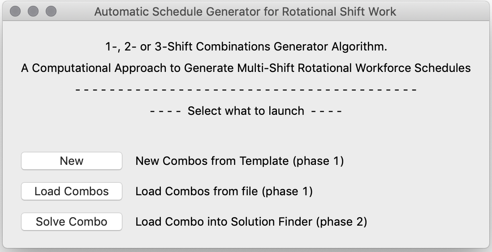

# RSW Algo README
A simple Python-based Computational Approach to Generate Multi-Shift Rotational Workforce Schedules.

Generating schedules for shift workers is essential for many employers, whether the employer is a small or a large industrial complex, research laboratory, or other businesses involving shift works.

Previous methods for creating rotational workforce schedules included interactions between the schedule maker and the algorithm, including defining the length of sequences of consecutive days of working shifts.

In this project, an algorithm takes into account inputs (or constraints) from the schedule maker and then presents the possible combinations (incl. that all shifts must be filled, working hours per week, minimal resting time, etc.) in a first phase. The schedule maker can then select which combinations are most feasible to proceed with in the second phase, where the combinations have solutions presented followed by the final schedules being constructed and exported.

## Getting started
A suggestion on how to get started is given in a chronologically suggested order:
- Installation procedure
- Description of how to use the package
- Example usage procedure

### Installation procedure
1. In order to setup this package, ensure that Python 3.x (3.7 is recommended) is installed on the computer.
2. Check Python version used with the PIP package manager such that it points to the correct Python version (pip -V).
3. Use PIP to install all packages required individually, see [requirements](requirements.txt), install them as a package via:

    pip install -r requirements.txt

  or use conda to create the environment:

    conda env create --file environments.yml

4. If all required Python packages have been successfully installed, the package is ready.

## Description of software
### Nomenclature
In this application, the following terminology is used:
- The problem: The rotational shift-work schedule that needs to be created based upon a set of constraints.
- Combination: A list of zeroes (days off) and ones (work days)
- Solution: A combination that solves the problem.

### Launcher
The package includes a simple launcher which can be launched by executing the following (with current directory being this repository):

    python RSW.py

The launcher gives the user to either start from scratch, continue from a saved file in "Phase 1" (from a previously generated list of combinations), or continue from a saved file in "Phase 2" (potential solutions).

### Phase 1
Phase 1 consists of creating boolean combinations that may solve the problem, see Figure 1 for the GUI.

Upon filling in the list of constraints, pressing the "Generate Combinations" button activates the algorithm that runs through the various permutations of boolean lists. The algorithm returns a list of combinations, of which each have the potential of solving the problem.

Each combination is presented one-by-one in a simple matrix where each column is a day (e.g. Mon-Fri or Sun-Sat). The slider and spin-box next to it allows for quick browsing through the different combinations.

The button "Proceed with this combo to next phase" launches "Phase 2" with the combination.

### Phase 2
Phase 2 consists of finding solutions to a combination that can solve the problem, see Figure 2 for the GUI.

It can be launched with a saved file from the launcher or from Phase 1.

Days off are represented by zeroes whilst shifts are converted to the shift type label. Shifts can be manually altered one-by-one or the application can check which solutions follow the existing constraints if there are any valid solutions. Shift orders not allowed are marked in red, weekly resting checks ensure rolling weekly resting time is enforced, and the bottom table shows the shift occupancy.

### Example Usage Procedure
The problem can be defined as follows:

*A rotational 4-week 2-shifts workforce schedule has to be constructed with the parameters defined in Table 1.*

Table 1: The constraints for the 4-week 2-shifts workforce schedule.

| Parameter     | Value |
| :----------: | :----------: |
| Number of shifts per days                     | 2 |
| Shift Labels                                  | D, E |
| Number of working days per week               | 7 |
| Number of weeks to cycle over                 | 4 |
| Number of workers per shift (minimum)         | 1 |
| Shift lengths                                 | 8.33 |
| Weekly working hours per worker               | 36.00 |
| Weekly minimum single continuous resting time | 36 |
| Daily minimum continuous resting time         | 11 |
| Number of days off clustered                  | 2 |
| Number of shifts per shift cycle              | 18 |

1. Start the launcher.
2. Launch "Phase 1" by clicking on *New*.
3. Define the parameters as in Table 1 above.
4. Click on *Generate Combinations* and wait until this is completed.
5. Drag the slider to combination \#212.
6. Click on *Proceed with this combo to next phase*, assuming this combination seems to solve the problem, to launch "Phase 2" with this combination.
7. Click on *Find Solutions* and wait until this is completed.
8. Select solution \#0 using the slider and click on the *Export* button.
9. Define a name for the file, proceed, and select .CSV as file format.

The end result is a CSV-file that can be imported into e.g. Microsoft Excel (2018), with some modifications resulting in a ready schedule for the rotational shift workforce and hence effectively solving the problem presented.

## Figures

Figure 0: The RWS:ing Application's launcher.

Figure 1: The RWSing Application's algorithm's "phase 1 GUI" (dark and light themes, left and right, respectively). In the left figure, the combinations have been generated. In the right figure, the combinations have been loaded from a file.

Figure 2: The RWS:ing Application's algorithm's "phase 2 GUI" as launched from the "phase 1 GUI" and with the second Thursday's shift changed to an evening shift (left) and after finding solutions, showing the first solution (right).

Figure 3: Example procedure results. Phase 1 was performed using the parameters defined in Table 1 and with free days clustered in pairs. Two boolean combinations were selected, followed by finding and selecting a solution for both, and then exported as CSV and imported in Microsoft Excel (2018).

## License
The `RSW` package is licensed under the GNU General Public License v3.0.

## Contribution
Any contribution is more than welcome, just follow [Contributing](CONTRIBUTING.md).
