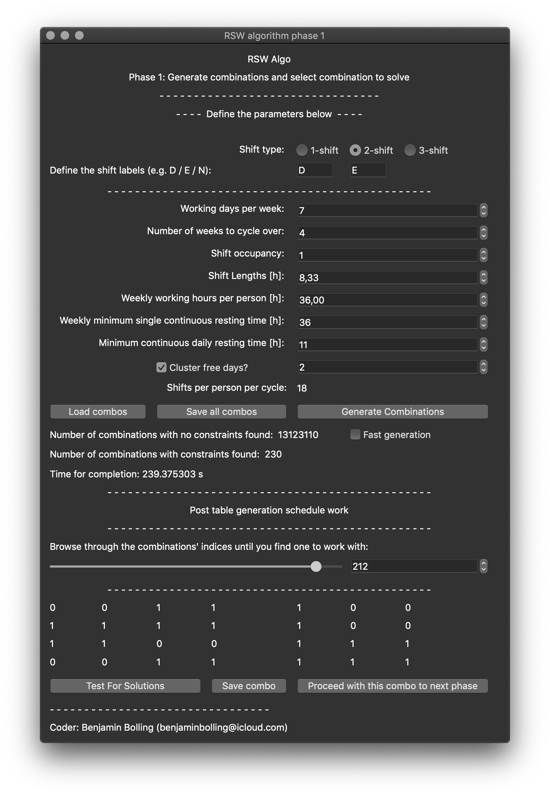
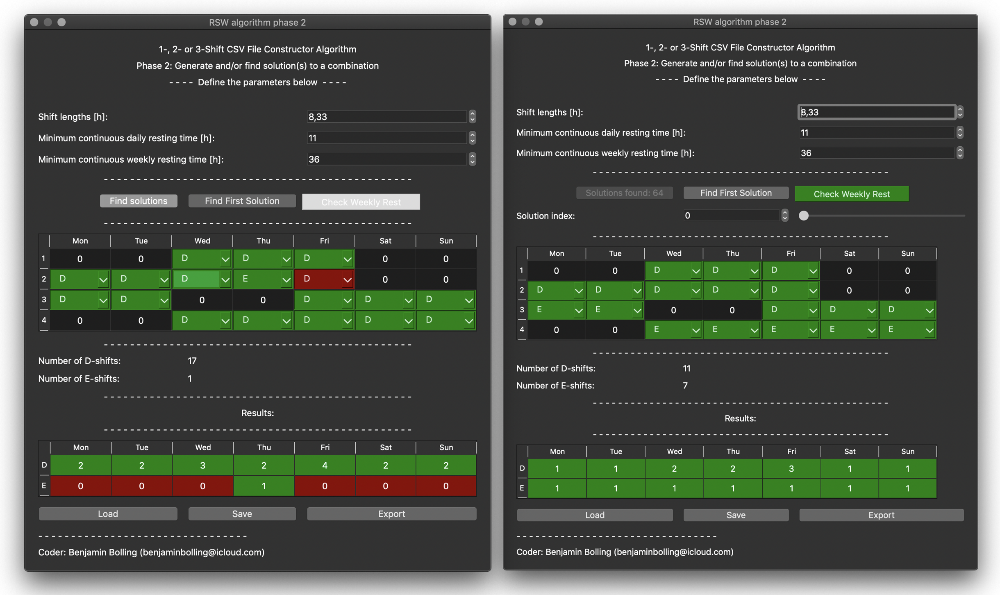

# RSW Algo README
A Computational Approach to Generate Multi-Shift Rotational Workforce Schedules.

## Installation procedure
Step-by-step ...

## Phase 1
Phase 1 consists of a list of parameters and ...

## Phase 2
The "phase 2 GUI" is launched with a selected combination as input (which can be seen in Figure 2 to the left).

The free days are all represented by zeroes whilst all other shifts (ones) are converted to the first defined shift type label. For $N>1$, each shift can be replaced by another shift via dropdown menus. The GUI shows the number of shifts of each type per week and a table with the results, i.e. the number of workers per shift and day. Shifts that are occupied have green background whilst shifts that are unoccupied have a red background.

If the continuous resting time between two assigned shifts is too low, the background colour of the second shift becomes red (e.g. a Friday day-shift after a Thursday evening-shift if the continuous resting time has to be at least 11 hours, as shown in Figure 2 to the left). With enough resting time in between shifts, the background of the second shift is be green.

## Example Usage Procedure
Phase 1 is launched, and the parameters selected are as defined in Table 1 below.

Table 1: Constraints, i.e. the variables and their meanings, and some example values.

| Parameter     | Value |
| :----------: | :----------: |
| Number of shifts per days                     | 2 |
| Shift Labels                                  | D, E |
| Number of working days per week               | 7 |
| Number of weeks to cycle over                 | 4 |
| Number of workers per shift (minimum)         | 1 |
| Shift lengths                                 | 8.33 |
| Weekly working hours per worker               | 36.00 |
| Weekly minimum single continuous resting time | 36 |
| Daily minimum continuous resting time         | 11 |
| Number of days off clustered                  | 2 |
| Number of shifts per shift cycle              | 18 |

After defining these values, the *Generate Combinations* button is clicked. During the generation, the approved combinations are stored in a temporary file. When finished, the generated shift arrays (combinations) can be browsed through using the slider or the numerical input field. The shift arrays are constructed such that each week or worker (depending on the viewing angle) is represented in separate rows.

The slider is moved to combination \#212, and the bottom-right button *Proceed with this combo to next phase* is clicked - launching phase 2 on this combination as input. In the phase2 window, the button *Find Solutions* is clicked, generating all possible solutions for the combination. The slider in this window is not moved, making it remain on solution \#0. The solution is exported as a .CSV file. The same is repeated but using combination \#43 in phase1 and solution \#43 in phase 2. The files are imported into a new spreadsheet in Microsoft Excel (2018) and combined, followed by adding colours to highlight and differentiate each week, and lines for all rows and columns. The sum of each shift specie per day has also been calculated in the spreadsheet (using the COUNTIF(cells;shift) formula of Microsoft Excel (2018)), see Figure 3.

These two schedules are filled as evenly as possible with the exception of Fridays, which have been selected such that all shift workers are scheduled to work (suitable for e.g. activities when *all hands on deck* is required. This schedule has also ensured that each shift is occupied by a minimum of two shift workers.

## Figures

Figure 1: The RWS:ing Application's algorithm's "phase 1 GUI" (dark and light themes, left and right, respectively). In the left figure, the combinations have been generated. In the right figure, the combinations have been loaded from a file.

Figure 2: The RWS:ing Application's algorithm's "phase 2 GUI" as launched from the "phase 1 GUI" and with the second Thursday's shift changed to an evening shift (left) and after finding solutions, showing the first solution (right).

Figure 3: Example procedure results. Phase 1 was performed using the parameters defined in Table 1 and with free days clustered in pairs. Two boolean combinations were selected, followed by finding and selecting a solution for both, and then exported as CSV and imported in Microsoft Excel (2018).
