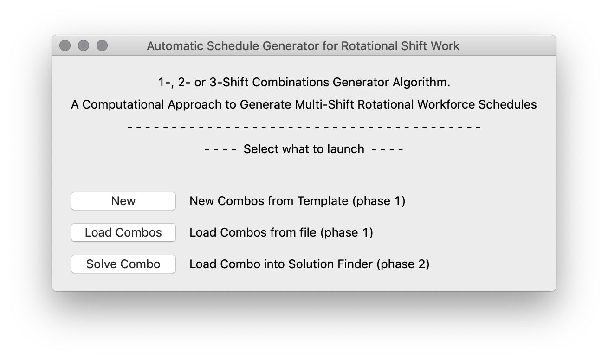
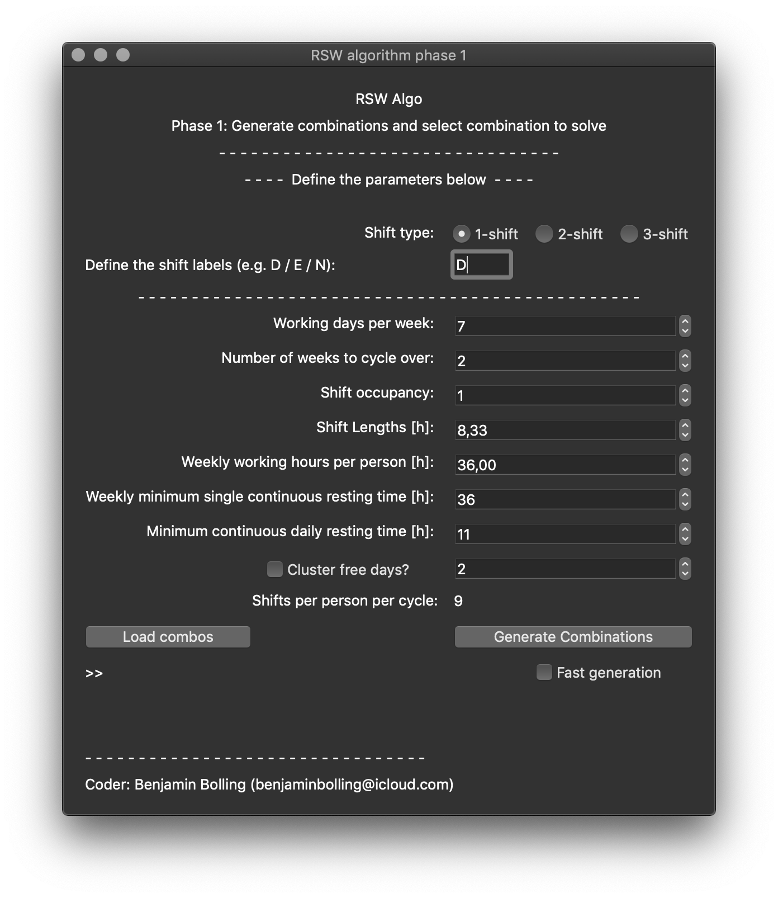
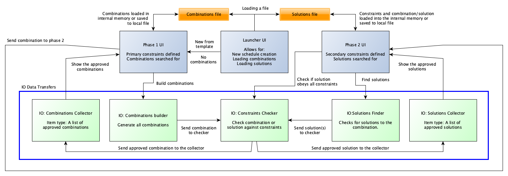
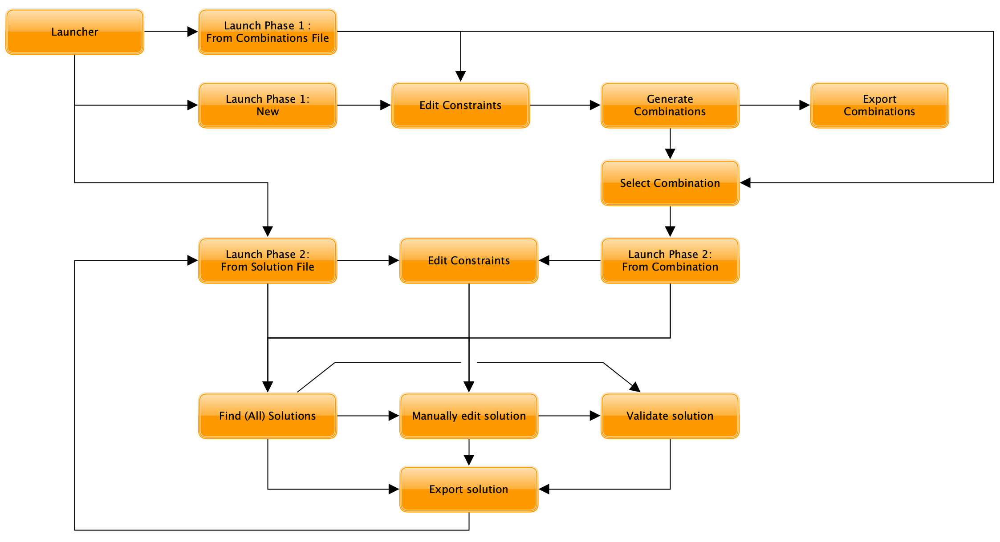

# Statement of Need
All around the world, research institutes and industrial complexes make use of workforces working multiple shifts per day in order to utilise maximum efficiency and profitability of the facility. Creating shift work schedules has, however, always been a challenging task, especially such that are equal for all workers and at the same time distributes the shifts evenly and properly to prevent staff burnout [@Tristan2020].

The purpose and aim of this package is to support research institutes and industrial complexes at which non-standard working hours are applicable with a computational tool to create rotational workforce schedules by providing the user (schedule-maker) with all possible schedules for a set of input constraints/conditions (such as shift lengths, weekly working hours and -resting time) by constructing and utilising a Combinatoric Generator and a Cartesian Product calculator.

Comparing to already available software that (by the developer/author) could be found, this method uses a computational semi-automatic approach rather than the more traditional manual creation of schedules. This computational approach is also able to check and identify every combination that could satisfy the required rotational workforce schedule, if there are any that fully satisfy the requirements. Hence, this application can be used as an aid for schedule-makers by being either supplied with ready schedules or by schedules working as good starting points. It can therefore also be considered as an attempt to implement a slightly different method, which e.g. together with other shift scheduling methods may be combined to find more strategic methods for building rotational shift workforce schedules.

Another approach and need of the application is to serve as a support function for creating rotational shift workforce schedules for large-scale scientific research facilities such as particle accelerators, at which the workforce size is many time very constrained. In those situations, the creation of schedules can be very complex and difficult, making a tool such as this useful. In other cases, it can be used to prove that the constraints are too tight and that these cannot be fulfilled by any schedule, saving time for shift schedulers and hence also for the research facility.

Conclusively, this package provides a graphical user interface (based on PyQt5 [@PyQtReference]) tool for generating and constructing acceptable shift arrays if there are any possible arrays following all user-defined constraints. These can be exported to the file formats ODS, CSV, and txt, with the arrays ready to be used as they are or as templates for further modifications (e.g. swapping shifts between workers and hence taking into account individual workers' needs).

\pagebreak

## Introduction
In order to achieve schedules for the workers that treats everyone equally, the focus of this package is on so-called rotational workforce schedules (RWSs). Rotational workforce schedules means that the schedule rotates after time, and hence, the other option would be static shift schedules. In this project, the term 'shift arrays' is defined to represent all possible schedules following a list of constraints, originating from e.g. country laws, organisational needs, and/or workforce requests.

## Computational Approach and Results
In this approach, each worker has the same schedule shifted by one week, resulting in that all workers follow the same schedule. The project has been divided into two phases, *Boolean Shift Arrays* (in which boolean shift arrays are generated) and *From Boolean Shift Arrays to a RWS* (in which a selected boolean shift array is shaped into its final RWS layout). The high-level software architecture flow and a user flowchart can be seen in \autoref{fig:flow} and \autoref{fig:userflow}, respectively.

### Boolean Shift Arrays (phase 1)
A boolean shift array is defined such that 1 means that the worker is working and 0 that the worker is not. The input species (also known as constraints) and their respective values used are shown in Table 1 below.

Table 1: Constraints, i.e. the variables and their meanings, and some example values.

| Variable       | Meaning     | Value |
| :------------- | :----------: | :----------: |
| $N$ | number of shifts per days            | 2 |
| $n_{cf}$ | number of days off clustered      | - |
| $n_{S}$ | number of shifts per shift cycle      | 18 |
| $n_{W}$ | number of weeks to cycle over      | 4 |
| $n_{wd}$ | number of working days per week   | 7 |
| $n_{wS}$ | Number of workers per shift (minimum) | 1 |
| $t_{d}$ | daily minimum continuous resting time  | 11 |
| $t_{r}$ | weekly minimum single continuous resting time | 36 |
| $t_{s}$ | shift lengths                      | 8.33 |
| $t_{W}$ | weekly working hours per worker    | 36.00 |

Since each week also resembles a worker, the shift array can be set up as a matrix with 7 columns (each representing the days of a week) and $n_{W}/7$ rows (each representing a worker). The columns can then be summed to achieve the shift occupancy (or how many people are working each shift). Thus, the phase1 algorithm only allows shift arrays to pass for which all shifts are occupied by at least one worker, with a shift represented by the first $n_{wd}$ days for each week. In order to extend to not only use single shifts but also 2- or 3-shifts, a logical condition was added into the algorithm: For $N$ shifts per day, each day has to be filled with at least $N$ workers.

In order to avoid all working days from being clustered together, the constraint for weekly minimum single continuous resting time is added ($t_{r}$). The algorithm ensures that all passed shift arrays have at least $t_r$ hours of free-time over any given 7-day period.

The number of shifts per shift array is, in this algorithm, calculated by

\begin{equation}
n_{S} = \text{ceil}(t_W / t_s)
\end{equation}

with the reason for using ceiling function (and not the floor function) being the argument that it is better with a couple of more hours than fewer. In order to cluster days off (n_{cf}), the algorithm's GUI has an optional additional constraint that serves this purpose and simply does not allow shift arrays with 0:s in clusters less than this through.

By using the input $n_W \times n_{wd}$ as the iterable and $n_{S}$ as the length of subsequences of elements from the iterable, the same methodology as the *combinations* function of the *itertools* module in Python [@PythonReference] (a combinatoric generator) is used for creating each shift array. It can be simply described as creating an array of combinations (in this case, zeroes and ones corresponding to a day off or shift work, respectively) with a specific length (number of days in a cycle). By imposing the other inputs as constraints on whether a shift array should be appended to accepted shift arrays, the reason for not using the built-in Python module becomes clear: Python's built-in module returns all array combinations that are possible without any imposed constraints, which quickly escalates to becoming too large for a personal computer's internal memory to handle.

With this, the final result is an array of shift arrays in which each shift array is filled with $7n_{S}$ 1:s and $n_{W}(7-n_{S})$ 0:s whilst obeying the above mentioned constraints.

As there are ${n\choose r}$ ways to choose r elements from a set of n elements [@EncyMath], the number of possible combinations ($C$) can be expressed by using the factorial of the binomial coefficient:

\begin{equation}
C = \frac{n!}{r! \times (n-r)!}.
\end{equation}

with $n$ being the number of days in total in a shift cycle and $r$ being the number of working days per worker in the shift cycle.

Translating this into the variables defined in Table 1 yields the total number of combinations (without constraints), which is hence also the maximum number of accepted combinations:

\begin{equation}
C = \frac{n_{W} \times n_{wd}!}{n_{S}!(n_{W} \times n_{wd} - n_{S}!)}.
\end{equation}

### From Boolean Shift Arrays to RWS (phase 2)
In this phase, a new list of combinations with free days clustered in pairs has been generated and a combination selected to proceed with (combination 212 as it has two out of four weekends off (note the zeroes in the bottom table in \autoref{fig:phase1} to the right).

Pressing the *Find solutions* results in what is shown in \autoref{fig:phase2} (right figure). A schedule can also be constructed completely by hand, but note that the algorithm will find all possible combinations that obey the given constraints. The algorithm is a Cartesian Product calculator, in which each set is a list of shifts (1 = Day, 2 = Evening, etc.) with one set per working day:

\begin{equation}
\text{combinations} =
\begin{pmatrix}
1\\
2\\
\vdots
\end{pmatrix} \times
\begin{pmatrix}
1\\
2\\
\vdots
\end{pmatrix}  \times \hdots \times
\begin{pmatrix}
1\\
2\\
\vdots
\end{pmatrix} =
\prod_{i=1}^{n_{wd}}
\begin{pmatrix}
1\\
2\\
\vdots
\end{pmatrix}_{i}
=
\begin{cases}
[1\text{ }1\text{ }\hdots\text{ }1]\\
[1\text{ }1\text{ }\hdots\text{ }2]\\
\vdots\\
[2\text{ }2\text{ }\hdots\text{ }1]\\
[2\text{ }2\text{ }\hdots\text{ }2]
\end{cases}
\end{equation}

where each array in the resulting product is considered as a possible shift schedule matrix. Imposing constraints (resting time between shifts and ensuring all shifts are filled) on each combinations results in solutions from which the user can choose between.

Since all combinations are stored in a matrix form before different combinations are removed from the final solutions matrix, large datasets require severe amount of internal memory for the Cartesian Product method to work. For this, a controlling script has been implemented which calculates a pre-estimate of required internal memory. Approximating that each character in the shiftarray takes up 8 byte of memory yields

\begin{equation}
IM \approx N_{size} = N^{n_{S}} \times n_S,
\end{equation}

where $N_{size}$ is the total number of zeroes and ones in the full matrix. If the estimated size of the resulting matrix from the operation exceeds 1Gb, the user is prompted whether to continue with the default Cartesian Product method or to use a less internal memory demanding recursive method.

## Benchmarking results
### Benchmarking Computer Specifications
The algorithm benchmarking was done on an Apple MacBook Pro with the specifications defined in Table 2.

Table 2: Benchmarking computer specifications.

| Definition     | Value        |
| :------------- | :----------: |
| Computer type: | Apple MacBook Pro (13-inch, 2019) |
| OS: | macOS Mojave v. 10.14.6 |
| Processor: |  2.8 GHz Intel Core i7 processor |
| Internal Memory: | 16 GB 2133 MHz LPDDR3 |
| Graphics Card: |  Intel Iris Plus Graphics 655 1536 MB |

### Benchmarking Phase 1
In the GUI, there is a "fast generation" checkbox which stops the algorithm from further calculations once the first 100 approved combinations have been found. This way, computation time can be lowered (in comparison to "full generation" which will go through all possible combinations from the boolean array). For the parameters defined in Table 1, the time it took to complete decreased from 508.7 s (for a full generation) to 24.55 s (for the full generation) (see Table 3), which is a decrease in time by 95\%.

The parameters used are defined in Table 1, with the exception of $N$ and Shift types' labels. Note that for Table 3, the number (\#) of weeks given is the minimum amount of weeks required for a full shift cycle in order to find acceptable combinations for the N-shift problems (with $N = 1,2,3$ for single-, two- and three-shifts, respectively). The free days clustering option is not selected for the benchmarking.

\pagebreak

Table 3: Benchmarking for fast and full generation of the Boolean Arrays (as defined in Section 3.1 for Phase 1), and the number of combinations and approved combinations found for full generations of the Boolean Arrays (as defined in Table 1). The types are single-, two- or three-shifts during 5 or 7 days per week, and the internal memory (IM) is given for the different shift array objects.

| Type: | 1-shift, 5d/w | 1-shift, 7d/w | 2-shift, 7d/w | 3-shift, 7d/w   |
| :------------- | :----------: | :----------: | :----------: | :----------: |
| \# of weeks: | 1 | 2 | 4 | 5 |
| Combinations (total): | 1 | 2 002 | 1.312e+07 | 1.476e+09 |
| Combinations (accepted): | 1 | 462 | 1.668e+06 | 1.138e+07 |
| IM: | 88 B | 4.216 kB | 13.53 MB | 100.4 MB |
| Time (fast) [s]: | 7.224e-05 | 1.497e-02 | 24.55 | 3 087 |
| Time (full) [s]: | 7.224e-05 | 5.211e-02 | 508.7 | 6.627e+04 |

Plotting the benchmarking results yields the logarithmic graph in \autoref{fig:benchmarking}. As can be seen, the computation time $T_{C}$ increases exponentially with the number of weeks in a shift cycle on average in accordance with
\begin{equation}
T_C \text{(full)} = \exp{\{5.046 \times n_W\}} \times 9 \times 10^{-7}
\end{equation}
and
\begin{equation}
T_C \text{(fast)} = \exp{\{4.254 \times n_W\}} \times 2  \times 10^{-6}
\end{equation}
for the full and fast generations, respectively, calculated with an exponential regression.

### Benchmarking Phase 2
If the given combination has only a single shift specie, there is one solution for the given combination. If there are more than one shift specie, multiple solutions may be found. The main impact on time consumption is the number of accepted combinations $N_{C}$. Limiting factors are not limited to time only but also on the internal memory due to that a Cartesian Product method is used, meaning all combinations are stored as string objects in an array. Some values have been timed and calculated in Table 4 using the Cartesian Product method.

Table 4: Benchmarking for Phase 2: Time required for obtaining all solutions for different $n_{S}$, $n_{W}$ and $N$ using the Cartesian Product method, and the internal memory (IM).

| Type ($N$): | 2-shift | 2-shift | 2-shift |
| :------------- | :----------: | :----------: | :----------: |
| $n_{W}$: | 3 | 4 | 4 |
| $n_{S}$: |14 | 18 | 20 |
| Solutions (for each combination): | 16 384 | 262 144 | 1 048 576 |
| Time [s]: | 0.2963 |  5.843 | 12.72 |

Note: The number of solutions for each combination in Table 4 is the total number of combinations for the solution matrix (and not the number of viable solutions).

\pagebreak

## Comparison to similar softwares
Different commercial softwares are available for shift scheduling using computational methods. In 2004, [@Burke2004] made a comprehensive literature review of a wide range of approaches, including optimising approaches (mathematical programming), multi-criteria approaches (goal programming), artificial intelligence methods, heuristic approaches, and metaheuristic approaches. Common for these approaches is that they use the constraints by the user and are able to provide more-or-less ready schedule(s), with the limitations for the mathematical approaches not being appropriate and requiring post-generation work. Goal programming defines a target for each criterion and their relative priorities ([@Burke2004]) by applying mathematical programming or by tackling metaheuristics within a multi-objective framework. The complexities from goal programming arise from that real world problems are difficult to solve without some optimisation from a planner.

Many approaches utilising artificial intelligence imitate human reasoning and may hence produce reasonable schedules, such as [@PATAT2002] which includes and takes into account parameters such as the appropriate skill mix and staff-to-patient ratios.

[@Laporte2004] developed a constraint programming algorithm for the construction of rotating shift schedules with the algorithm building the schedules per column (per day), looking for allowed shift stretches (including days off). The pros of their method over this project is that the required computing power is lower than in this project as the shift patterns. However, the method populates the shift schedules with the shift species and does not give the user a possibility to do the step in the middle from this project, which is selecting the shift- and rest-day-patterns (referred to as a combination). Therefore, the cons of their algorithm in comparison to this would be that the number of solutions could be very high and require a large amount of computer storage. Moreover, their method had difficulties to obtain evenly spaced full weekends off, which the shift pattern scroll tool in this project can be utilised for finding (see bottom of \autoref{fig:phase1}).

## Conclusions
In this project, an algorithm has been constructed which generate schedules for different number of weeks to cycle over. The current issue is that the computational complexity (and hence the required computation time) increases with the number of weeks per cycle, as can be seen in Table 3 and \autoref{fig:benchmarking}. This means that for a higher amount of weeks in a shift cycle, this application will need further development in order to have more efficient ways of finding the solutions and/or deployment of the application onto super-computers for generating the Boolean Arrays.

For up to 5 weeks in a shift cycle it is possible to use a general-purpose computer such as the benchmarking Apple MacBook Pro with specifications defined in Table 2. It has thus been demonstrated that the application can be used to generate 1, 2 and 3-shift schedules. The software in this project has also been compared to a few existing methods via a short literature study, showing that it offers both benefits and disadvantages.

Future development plans include adding functionalities in phase 1 such as filtering on number of free weekends and taking into account competences of the shift workers (to ensure full coverage of potential shift competence requirements). An important future development needed is restructuring part of the algorithm to lower the required processing power and hence time needed. Another future development plan includes importing an existing schedule with labels as a CSV-file directly into phase 2 such that modifications and/or checks can be done to assure the schedule is compliant with local rules for the workers. These improvements would further strengthen the usability of this application.

## Figures
{ width=60% }

{ width=80% }

{ width=80% }

{ width=80% }

{ width=80% }

{ width=80% }

\pagebreak

## Acknowledgements
The author wants to thank his direct line-manager at European Spallation Source for asking the question if it would be possible to create a software for generating shift schedules, which lead to the idea of creating this project and after a while lead to this final state. The author also wants to thank the reviewers for taking their time reviewing this project.

## References
