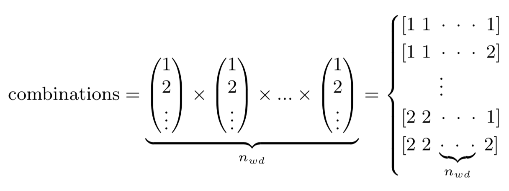

# Motivation
The purpose and aim of this package is to support research institutes and industrial complexes at which non-standard working hours are applicable with a computational tool to create rotational workforce schedules in a way that rules, such as minimum daily and weekly single continuous resting time, are followed.

## Introduction
Creating shift work schedules has always been a challenging task, especially such that are equal for all workers and at the same time distributes the shifts evenly and properly to prevent staff burnout. In order to achieve schedules for the workers that treats everyone equally, the focus will be on so-called rotational workforce schedules (RWS:s). Rotational workforce schedules means that the schedule rotates after time, and hence, the other option would be static shift schedules. In this project, the term 'shift arrays' is defined to represent all possible schedules following a list of constraints.

## Computational Approach and Results
In this approach, each worker has the same schedule shifted by one week, resulting in that all workers follow the same schedule. The project has been divided into two phases, *Boolean Shift Arrays* (in which boolean shift arrays are generated) and *From Boolean Shift Arrays to a RWS* (in which a selected boolean shift array is shaped into its final RWS layout).

### Boolean Shift Arrays (phase 1)
A boolean shift array is defined such that 1 means that the worker is working and 0 that the worker is not. The inputs (also known as constraints) used are shown in Table 1 below.

Table 1: Constraints, i.e. the variables and their meanings, and some example values.

| Variable       | Meaning     | Value |
| :------------- | :----------: | :----------: |
| *N* | number of shifts per days            | 2 |
| *ncf* | number of days off clustered      | 2 |
| *nS* | number of shifts per shift cycle      | 18 |
| *nW* | number of weeks to cycle over      | 4 |
| *nwd* | number of working days per week   | 7 |
| *nwS* | Number of workers per shift (minimum) | 1 |
| *td* | daily minimum continuous resting time  | 11 |
| *tr* | weekly minimum single continuous resting time | 36 |
| *ts* | shift lengths                      | 8.33 |
| *tW* | weekly working hours per worker    | 36.00 |

Since each week also resembles a worker, the shift array can be set up as a matrix with 7 columns (each representing the days of a week) and *nW/7* rows (each representing a worker). The columns can then be summed to achieve the shift occupancy (or how many people are working each shift). Thus, the phase1 algorithm only allows shift arrays to pass for which all shifts are occupied by at least one worker, with a shift represented by the first *nwd* days for each week. In order to extend to not only use single shifts but also 2- or 3-shifts, a logical condition was added into the algorithm: For *N* shifts per day, each day has to be filled with at least *N* workers.

In order to avoid all working days from being clustered together, the constraint for weekly minimum single continuous resting time is added (*tr*). The algorithm ensures that all passed shift arrays have at least *tr* hours of free-time over any given 7-day period.

The number of shifts per shift array is calculated by

<i>nS</i> = ceil (<i>tW / ts</i>)

with the reason for using ceiling function (and not the floor function) is the argument that it is better with a couple of more hours than fewer. In order to cluster days off (ncf), the algorithm's GUI has an optional additional constraint that serves this purpose and simply does not allow shift arrays with 0:s in clusters less than this through.

By using the input *nW* &times; *nwd* as the iterable and nS as the length of subsequences of elements from the iterable, the same methodology as the *combinations* function of the *itertools* module in Python is used for creating each shift array. The other inputs are used as constraints on whether the shift array should be appended to the array of shift arrays or trashed, which shows the reason for not using the built-in Python module (which returns all array combinations that are possible, resulting in the returned arrays being too large for a personal computer's internal memory to handle).

With this, the final result is an array of shift arrays in which each shift array is filled with *7nS* 1:s and *nW(7-nS)* 0:s whilst obeying the above mentioned constraints. The number of possible combinations (*C*) can be then be expressed as:

<i>C = (nW &times; nwd)</i>!<i> / nS</i>!<i>(nW &times; nwd - nS)</i>!.

### From Boolean Shift Arrays to RWS (phase 2)
In this phase, a new list of combinations with free days clustered in pairs has been generated and a combination selected to proceed with (combination 212 as it has two out of four weekends off (note the zeroes in the bottom table in Figure 1 to the right).

Pressing the *Find solutions* results in what is shown in Figure 2 (right figure). A schedule can also be constructed completely by hand, but note that the algorithm will find all possible combinations that obey the given constraints. The algorithm is a Cartesian Product calculator, in which each set is a list of shifts (1 = Day, 2 = Evening, etc.) with one set per working day:

where each array in the resulting product is considered as a possible shift schedule matrix. Imposing constraints (resting time between shifts and ensuring all shifts are filled) on each combinations results in solutions from which the user can choose between.

Since all combinations are stored in a matrix form before different combinations are removed from the final solutions matrix, large datasets require severe amount of internal memory for the Cartesian Product method to work. For this, a controlling script has been implemented which calculates a pre-estimate of required internal memory. The required internal memory for different operations can be roughly calculated by

IM <i>&approx; NC &times; nS = NnS &times; nS</i>

returning the memory demand IM in bytes and where *NC = NnS* is the total number of combinations (without any constraints imposed).

If the estimated expected internal memory requirement for an operation exceeds 1Gb, the user is prompted whether to continue with the default Cartesian Product method or to use a less internal memory demanding recursive method.

## Benchmarking results
### Benchmarking Computer Specifications
The algorithm benchmarking was done on an Apple MacBook Pro with the specifications as defined in Table 2.

Table 2: Benchmarking computer specifications.

| Definition     | Value        |
| :------------- | :----------: |
| Computer type: | Apple MacBook Pro (13-inch, 2019) |
| OS: | macOS Mojave v. 10.14.6 |
| Processor: |  2.8 GHz Intel Core i7 processor |
| Internal Memory: | 16 GB 2133 MHz LPDDR3 |
| Graphics Card: |  Intel Iris Plus Graphics 655 1536 MB |

### Benchmarking Phase 1
In the GUI, there is a "fast generation" checkbox which stops the algorithm from further calculations once the first 100 approved combinations have been found. This way, computation time can be lowered (in comparison to "full generation" which will go through all possible combinations from the boolean array). For the parameters defined in Table 1, the time it took to complete decreased from 508.7 s (for a full generation) to 24.55 s (for the full generation) (see Table 3), which is a decrease in time by 95\%.

The parameters used are defined in Table 1, with the exception of *N* and Shift types' labels. Note that for Table 3, the number (\#) of weeks given is the minimum amount of weeks required for a full shift cycle in order to find acceptable combinations for the N-shift problems (with *N* = 1,2,3 for single-, two- and three-shifts, respectively). The free days clustering option is not selected for the benchmarking.

Table 3: Benchmarking for fast and full generation of the Boolean Arrays (as defined in Section 3.1 for Phase 1), and the number of combinations and approved combinations found for full generations of the Boolean Arrays (as defined in Section 3.1 for Phase 1).

| Type: | \# of weeks: | Combinations: | Approved Combinations: | Time (fast) [s]: | Time (full) [s]: |
| :------------- | :----------: | :----------: | :----------: | :----------: | :----------: |
| Single-shift, 5 days/week   | 1 | 1 | 1 | 7.224e-05 | 7.224e-05 |
| Single-shift, 7 days/week   | 2 | 2 002 | 462 | 1.497e-02 | 5.211e-02 |
| Two-shift, 7 days/week      | 4 | 13 123 110 | 1 668 226 | 24.55 | 508.7 |
| Three-shift, 7 days/week    | 5 | 1 476 337 800 | 11 383 225 | 3 087 | 6.627e+04 |

Plotting the benchmarking results yields the logarithmic graph in Figure 3. As can be seen, the computation time TC increases exponentially with the number of weeks in a shift cycle on average in accordance with

<i>TC</i>(full) = exp (5.046 &times; <i>nW</i>) &times; 9 &times; 10-7

and

<i>TC</i>(fast) = exp (4.254 &times; <i>nW</i>) &times; 2 &times; 10-6

for the full and fast generations, respectively.

### Benchmarking Phase 2
If the given combination has only a single shift specie, there is one solution for the given combination. If there are more than one shift specie, multiple solutions may be found. The main impact on time consumption is the number of combinations *NC*. Limiting factors are not limited to time only but also on the internal memory due to that a Cartesian Product method is used, meaning all combinations are stored as list objects. Some values have been timed and calculated in Table 4 using the Cartesian Product method.

Table 4: Benchmarking for Phase 2: Time and estimated internal memory (IM) required for obtaining all combinations and solutions for different *nS* and *N* using the Cartesian Product method.

| Type (*N*): | *nS*: | *nW*: | Combinations: | Solutions: | IM: | Time [s]: |
| :------------- | :----------: | :----------: | :----------: | :----------: | :----------: | :----------: |
| 2-shift | 14    | 3 | 16 384 | 7 | 229.38 kB | 0.2963 |
| 2-shift | 18    | 4 | 262 144 | 64 | 4.7186 MB | 5.843 |
| 3-shift | 14    | 3 | 4 782 969 | 0 | 66.96 MB | 92.54 |
| 3-shift | 18    | 4 | 387 420 489 | - | 6.9736 GB | - |

## Conclusions
In this project, an algorithm has been constructed which generate schedules for different number of weeks to cycle over. The current issue is that the computational complexity (and hence the required computation time) increases with the number of weeks per cycle, as can be seen in Table 3 and Figure 3. This means that for a higher amount of weeks in a shift cycle, this application will need development in order to have more efficient ways of finding the solutions and/or deployment of the application onto super-computers for generating the Boolean Arrays.

For up to 5 weeks in a shift cycle it is possible to use a general-purpose computer such as the benchmarking Apple MacBook Pro with specifications defined in Table 2.
It has thus been demonstrated that the application can be used to generate 1, 2 and 3-shift schedules. Future development plans include adding an automated assignment function of shift types in phase 2, which would further strengthen the usability of this application.

## Figures

Figure 1: The RWS:ing Application's algorithm's "phase 1 GUI" (dark and light themes, left and right, respectively). In the left figure, the combinations have been generated. In the right figure, the combinations have been loaded from a file.

Figure 2: The RWS:ing Application's algorithm's "phase 2 GUI" as launched from the "phase 1 GUI" and with the second Thursday's shift changed to an evening shift (left) and after finding solutions, showing the first solution (right).

Figure 3: The benchmarking results in respect of time for fast- and full generation of the boolean arrays (on the left vertical axis), and the number of combinations gone through and the solutions found (on the right vertical axis).

## Acknowledgements
The author wants to thank his direct line-manager at European Spallation Source for asking the question if it would be possible to create a software for generating shift schedules, which lead to the idea of creating this project and after a while lead to this final state.

## References
